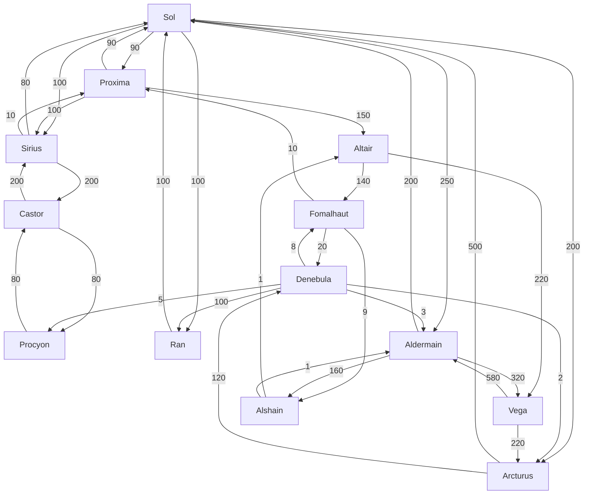

<h1 align="center">Technical Challenge - Interstellar Route Planner</h1>

# Brief
**Hyperspace Tunneling Corp** manages a system-to-system web of hyperspace accelerators that spans the United Terran Systems. They charge a fee to their users in order to use their network but they want to expand their business.

Recently, they've expanded into transporting people through their network using light transport space-ships that can take up to 5 people to the accelerator and then use their hyperspace-enabled ships to travel to the destination accelerator.

We've been asked to develop a system to help calculate the costs of this journey for their clients.

A journey is defined as:

1. Journey to the accelerator:
    * **Personal Transport**: £0.30/[AU](https://en.wikipedia.org/wiki/Astronomical_unit) (standard fuel cost) plus £5 per day for ship storage at the accelerator
    * **HTC Transport**: £0.45/[AU](https://en.wikipedia.org/wiki/Astronomical_unit) - (fits up to 5 people)

2. An outbound and an inbound hyperspace journey:
    * **Spaceflight**: £0.10/passenger/hyperplane-unit

HTC keeps a table with its accelerators and their connections:

| Accelerator ID | Accelerator Name | Connections and Hyperplane units of distance (HU)                          |
| -------------- | ---------------- | -------------------------------------------------------------------------- |
| SOL            | Sol              | RAN: 100HU PRX: 90HU SIR: 100HU ARC: 200HU ALD: 250HU  |
| PRX            | Proxima          | SOL: 90HU SIR: 100HU ALT: 150HU                                |
| SIR            | Sirius           | SOL: 80HU PRX: 10HU CAS: 200HU                                 |
| CAS            | Castor           | SIR: 200HU PRO: 120HU                                              |
| PRO            | Procyon          | CAS: 80HU                                                              |
| DEN            | Denebula         | PRO: 5HU ARC: 2HU FOM: 8HU RAN: 100HU ALD: 3HU         |
| RAN            | Ran              | SOL: 100HU                                                             |
| ARC            | Arcturus         | SOL: 500HU DEN: 120HU                                              |
| FOM            | Fomalhaut        | PRX: 10HU DEN: 20HU ALS: 9HU                                   |
| ALT            | Altair           | FOM: 140HU VEG: 220HU                                              |
| VEG            | Vega             | ARC: 220HU ALD: 580HU                                              |
| ALD            | Aldermain        | SOL: 200HU ALS: 160HU VEG: 320HU                               |
| ALS            | Alshain          | ALT: 1HU ALD: 1HU                                                  |

Accelerators are typically one-way, so while the route `A->B` can exist, it doesn't necessarily mean that `B->A` exists. Additionally, the hyperplane distance varies depending on which way you travel - Our best theories say the hyperplane not only does not match real-space but also has a preferred direction.

## Accelerator Data
Feel free to use any form of storage for the accelerator and routes information.

You can make use of [`create-local-db.sh`](./create-local-db.sh) which sets up a local DynamoDB with the data in the table above.

## Your task:
Write a program that suggests the cheapest quote for a customer's journeys.

This program should expose its logic via an API so that it can be consumed by other services or a browser client.

The API should expose, at least, the following endpoints:
* `GET`: `/transport/{distance}?passengers={number}&parking={days}` - returns the cheapest vehicle to use (and the cost of the journey) for the given `distance` (in AUs), `number` or passengers and `days` of parking
  * Accelerators typically sit above the star, so if you're on Earth and want to travel to the Sol accelerator, the distance would be ~1AU.
* `GET`: `/accelerators` - returns a list of accelerators with their information
* `GET`: `/accelerators/{acceleratorID}` - returns the details of a single accelerator
* `GET`: `/accelerators/{acceleratorID}/to/{targetAcceleratorID}` - returns the cheapest route from `acceleratorID` to `targetAcceleratorID`

These endpoints should be public.

### Expectations
* A git repository with the solution
    * Application code
        * Use any programming language you like (unless stated otherwise)
    * API documentation - e.g. Swagger, Postman collection
    * Any tests
    * Any CI/CD configuration - e.g. github actions
    * Any infrastructure-like config - e.g. Dockerfile(s)
    * Any supporting scripts to generate, package, run, etc...
* A dockerhub image with the solution and instructions on how to run it (and/or a docker-compose file)
    * Optionally, feel free to host this for us somewhere as well.

# Getting help
If you have any questions, please feel free to reach out to me via email (tco@keyholding.com).

**This is a genuine offer for help** - I want to see you succeed! - and it lets me understand how you work and communicate.
